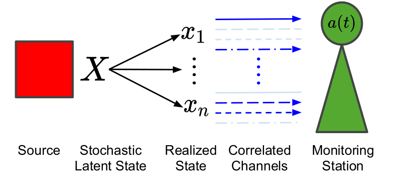

# Correlated Age-of-Information Bandits

  
   
<b>A regret plot example for an instance where UCUCB outperformed CUCB</b>

This repository is the authors' implementation of [the paper](https://arxiv.org/abs/2011.05032) Correlated Age-of-Information Bandits. 

### Usage Instructions

Coming Soon ...

### Related

- A New Approach to Correlated Multi-Armed Bandits [repository](https://github.com/ishank-juneja/UCUCB)

